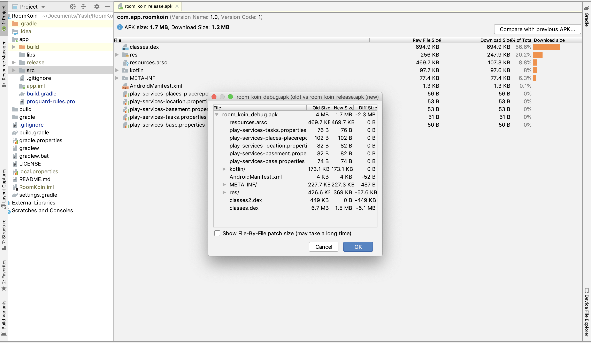
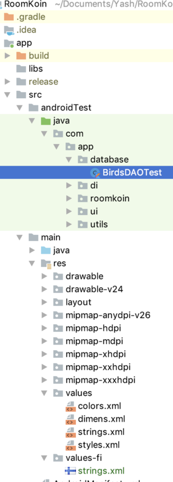
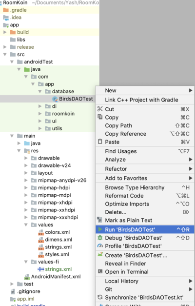
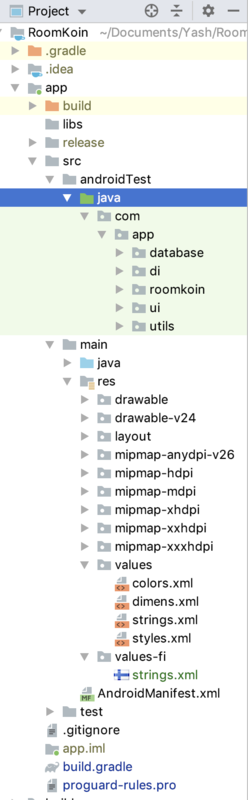
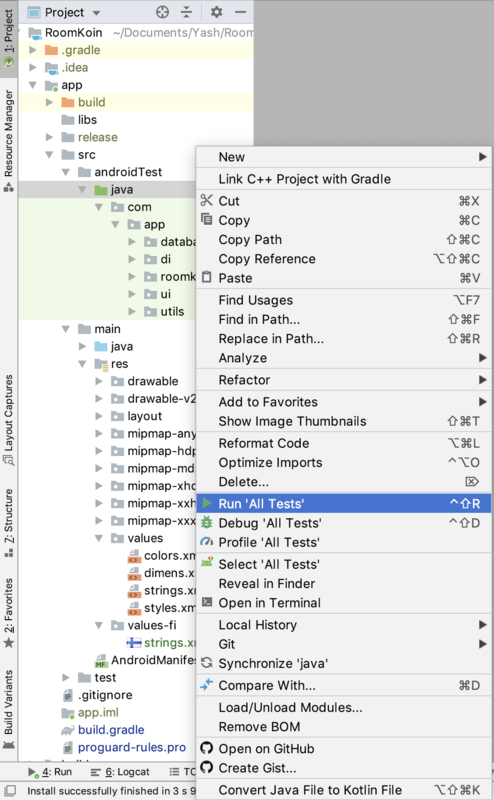

# RoomKoin

#### In English

This application makes offline records of Birds which includes the name of the species, rarity, notes, and
timestamp. Which we are storing with the help of the Android JetPack Room Database. Code structure includes
2 Classes one is to list the data and second is used to store the bird's records. App Structure is
developed by keeping in mind that, this app can be extended to provide support for Network API calls easily.

# Demo

## Languages, libraries and tools used

* __[Kotlin](https://developer.android.com/kotlin)__
* __[Room](https://developer.android.com/topic/libraries/architecture/room)__
* __[Koin](https://github.com/InsertKoinIO/koin)__
* __[Android Material Design](https://material.io/components/)__
* __[Android Architecture Components](https://developer.android.com/topic/libraries/architecture/index.html)__
* __[Instrumented Unit Testing](https://developer.android.com/training/testing/unit-testing/instrumented-unit-tests)__
* __[Espresso Testing](http://developer.android.com/training/testing/espresso)__

Above Features are used to make code simple, generic, understandable, clean and easily maintainable
for future development.Especially **Koin** for dependency injection and **Room Persistence Library**
for offline data Storage.

This application supports the screen rotation without losing the data and also use **Constraintlayout**
to design layout which gives better **UI support for both Mobile and Tablet**, and even when the screen rotates.

As this app developed as a production-ready app. So I had enabled the **Proguard** along with **minifyEnabled**
and **shrinkResources** True in released version along with basic support for **Android App Bundle**.
In the result of that, we can reduce the APK size along with we can also provide an extra security
layer to our code from decompiling or extracting of the code from APK. For more info refer the Image below.

## Automated tests

To run the test you must connect to real device or an emulator then you can choose in one of the following ways:

1. To run a single test, open the Project window, and then right-click a test and click Run.

**Then Click**

2. To run all tests in a directory, right-click on the directory and select Run tests

**Then Click**

## Running and Building the application

You can run the app on a real device or an emulator.

* __[Run on a real device](https://developer.android.com/training/basics/firstapp/running-app#RealDevice)__
* __[Run on an emulator](https://developer.android.com/training/basics/firstapp/running-app#Emulator)__

# Prerequisites
* __Android Studio 3.5__
* __Gradle version 3.5.1__
* __Kotlin version 1.3.50__
* __Android Device with USB Debugging Enabled__

# Built With

* __[Android Studio](https://developer.android.com/studio/index.html)__ - The Official IDE for Android
* __[Kotlin](https://developer.android.com/kotlin)__ - Language used to build the application
* __[Gradle](https://gradle.org)__ - Build tool for Android Studio

#### In Finnish

Tämä sovellus tekee offline-tietueita lintuista, joka sisältää lajin nimen, harvinaisuuden, muistiinpanot ja
aikaleima. Tallennamme Android JetPack Room-tietokannan avulla. Koodirakenne sisältää
2 Luokkaa yksi on tietojen luettelointi ja toista käytetään linturekisterien tallentamiseen. Sovelluksen rakenne on
kehitetty pitämällä mielessä, että tätä sovellusta voidaan laajentaa tukemaan Network API -puhelut helposti.

# Demo

## Languages, libraries and tools used

* __[Kotlin](https://developer.android.com/kotlin)__
* __[Room](https://developer.android.com/topic/libraries/architecture/room)__
* __[Koin](https://github.com/InsertKoinIO/koin)__
* __[Android Material Design](https://material.io/components/)__
* __[Android Architecture Components](https://developer.android.com/topic/libraries/architecture/index.html)__
* __[Instrumented Unit Testing](https://developer.android.com/training/testing/unit-testing/instrumented-unit-tests)__
* __[Espresso Testing](http://developer.android.com/training/testing/espresso)__

Yllä olevien ominaisuuksien avulla koodista tehdään yksinkertainen, yleinen, ymmärrettävä, puhdas ja helposti
ylläpidettävissätulevaa kehitystä varten. Erityisesti **Koin** riippuvuusinjektioon ja ** huoneen pysyvyyskirjasto **
offline-tietojen tallennusta varten.

Tämä sovellus tukee näytön kiertoa menettämättä tietoja ja käyttää myös **Constraintlayout**
suunnitella asettelua, joka antaa paremman **käyttöliittymätuen sekä mobiililaitteille että
tablet-laitteille** ja jopa näytön kääntyessä.

Koska tämä sovellus kehittyi tuotantoon valmis sovellus. Joten olin ottanut **Proguardin** käyttöön **minifyEnabled** kanssa
ja **shrinkResources** Totta julkaistu versio yhdessä **Android App Bundlen** perustuen kanssa.
Tämän seurauksena voimme pienentää APK-kokoa, samalla kun pystymme tarjoamaan myös ylimääräisen turvallisuuden
kerros koodillemme koodin purkamisesta tai purkamisesta koodista APK: sta. Katso lisätietoja alla olevasta kuvasta.

## Automatisoidut testit

Testin suorittamiseksi sinun on oltava yhteydessä oikeaan laitteeseen tai emulaattoriin, jolloin
voit valita jollain seuraavista tavoista:

1. Voit suorittaa yhden testin avaamalla projekti-ikkunan, napsauttamalla hiiren kakkospainikkeella
testiä ja napsauttamalla Suorita.

**Napsauta sitten**

2. Suorita kaikki testit hakemistossa napsauttamalla hiiren kakkospainikkeella hakemistoa ja
valitsemalla Suorita testit

**Napsauta sitten**

## Sovelluksen suorittaminen ja rakentaminen

Voit suorittaa sovelluksen oikealla laitteella tai emulaattorilla.

* __[Suorita oikealla laitteella](https://developer.android.com/training/basics/firstapp/running-app#RealDevice)__
* __[Suorita emulaattori](https://developer.android.com/training/basics/firstapp/running-app#Emulator)__

# Prerequisites
* __Android Studio 3.5__
* __Gradle version 3.5.1__
* __Kotlin version 1.3.50__
* __Android Device with USB Debugging Enabled__

# Built With

* __[Android Studio](https://developer.android.com/studio/index.html)__ - The Official IDE for Android
* __[Kotlin](https://developer.android.com/kotlin)__ - Language used to build the application
* __[Gradle](https://gradle.org)__ - Build tool for Android Studio